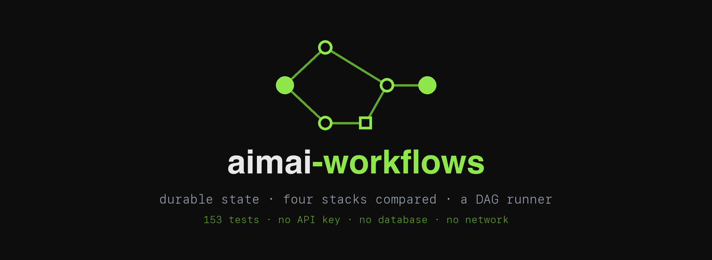

---
hide:
  - navigation
---

<div class="aimai-hero" markdown>

</div>

<div class="aimai-badges" markdown>
[](https://github.com/fport/aimai-workflows/actions/workflows/ci.yml)
[](https://github.com/fport/aimai-workflows/blob/main/pyproject.toml)
[](https://github.com/fport/aimai-workflows/blob/main/LICENSE)
</div>

# Bu ne

Agent orkestrasyonunun üç aşaması; her biri bir öncekinin ortaya çıkardığı
soruyu cevaplıyor. [aimai-kit](https://github.com/fport/aimai-kit) üzerine
kurulu: provider, prompt, tool ve agent katmanları oradan geliyor, bu depo da
yalnızca orkestrasyonla ilgilenebiliyor.

```bash
git clone https://github.com/fport/aimai-workflows && cd aimai-workflows
uv sync --all-extras --group dev
uv run pytest        # 167 test: API anahtarı yok, veritabanı yok, ağ yok
```

Bir LLM çağrısı saniyeler sürer. Bir agent koşusu dakikalar. Bir insan onayı
günler. Bu depodaki her şey bu aradan çıkıyor.

---

## Üç aşama

<div class="grid cards" markdown>

-   **[06. Kalıcı state ve insan onayı](06-contract-graph.md)**

    Bir tedarikçi sözleşmesini inceleyen, risk yüksekse insana duran ve tam
    olarak bir CRM notu yazan dört düğümlük bir LangGraph akışı.

    *Kapattığı tuzak:* `interrupt()` bulunduğu node'u ilk satırından itibaren
    yeniden çalıştırır. O çağrının üstüne yazılmış bir side effect her resume'da
    bir kez daha tetiklenir — ve resume tasarımın bütün amacıdır.

-   **[07. Tek akış, beş stack](07-workflow-stacks.md)**

    Aynı destek akışı saf Python, LangGraph, pydantic-ai, OpenAI Agents SDK ve
    Strands Agents ile; iş mantığı bir kez yazılmış ve beşi de onu import
    ediyor.

    *Kapattığı tuzak:* framework'leri beş ayrı program yazarak karşılaştırmak.
    O zaman her fark bir implementasyon farkı olur ve tablo hiçbir şey ölçmez.

-   **[08. Koordinasyon katmanını yazmak](08-dag-orchestrator.md)**

    Altında framework olmayan bir DAG runner: beş node tipi, dokuz durum, sert
    ve yumuşak bağımlılıklar, fingerprint tabanlı yeniden çalıştırma, saga
    telafisi.

    *Kapattığı tuzak:* kısmi başarıyı ya başarı ya başarısızlık saymak.
    `DEGRADED` bir durumdur, yayılır ve okuyucuya ulaşır.

</div>

---

## Altmış saniye

=== "Günlerce duraklayan bir inceleme"

    ```python
    from aimai_workflows.contract import RuleBasedReviewer, compile_graph, thread_config
    from aimai_workflows.contract.checkpointer import postgres_checkpointer
    from langgraph.types import Command

    with postgres_checkpointer() as saver:
        app = compile_graph(RuleBasedReviewer(), saver)
        config = thread_config("SUP-2025-0042")

        out = app.invoke(
            {"contract_no": "SUP-2025-0042", "document_uri": "high_risk.txt"},
            config,
            durability="sync",
        )
        out["__interrupt__"]      # gate'te duruyor; worker artık ölebilir

        # …saatler sonra, başka bir süreçte
        app.invoke(Command(resume="approve"), config, durability="sync")
    ```

=== "İki fiil, dört stack"

    ```python
    from aimai_workflows.stacks.plain import PlainStack
    from aimai_workflows.stacks.langgraph_stack import LangGraphStack

    for stack in (PlainStack(), LangGraphStack()):
        outcome = stack.run("T-1000")
        assert outcome.status == "awaiting_approval"   # 120 EUR'luk iade
        assert stack.approve("T-1000").status == "completed"
    ```

    ```bash
    python -m aimai_workflows.stacks.plain run T-1000
    uv run stack-bench            # results/bench.md
    ```

=== "Neyi kaybettiğini bilen bir graf"

    ```python
    from aimai_workflows.dagrun import NodeState, execute, open_store, validate
    from aimai_workflows.dagrun.flows import build_flow

    nodes = validate(build_flow(caselaw_fails=True))
    with open_store(":memory:") as store:
        report = await execute(nodes, "SZL-2026-0431", store)

    report.by_state(NodeState.DEGRADED)      # ['deliver', 'synthesis']
    report.records["synthesis"].result.output["opinion"]
    # "…INCOMPLETE: this opinion was written without caselaw."
    ```

    ```bash
    uv run dagrun --seed SZL-2026-0431 --dry-run
    ```

---

## Rakamlar ne diyor

Her rakam depodan, hiçbir kimlik bilgisi olmadan yeniden üretilebilir. Tam
tablolar ve uyarıları **[Ölçümler](measurements.md)** sayfasında.

| Deney | Bulgu |
|---|---|
| `SIGKILL` altında `durability` modları | `exit` bütün koşuyu kaybediyor; `sync` yarım kalan node'dan devam ediyor, yazma başına 0,23 ms karşılığında |
| Gate'in içindeki side effect | Tek onay için iki CRM notu — çalışır bir karşı-kanıt olarak duruyor |
| Beş stack, 50 talep | Üç agent SDK'sı da 3× model çağrısı harcıyor; LangGraph state machine'i elle yazmaktan daha az satır tutuyor |
| Stack başına duraklamış state | 461 B elle yazılan, 4,9 KB LangGraph, 4,4 KB pydantic-ai, 6,0 KB Strands, 11,4 KB Agents SDK |
| Koşu ortasında `SIGKILL` | Strands hiçbir şeyi tekrarlamıyor; graf sürümleri bir çağrı; diğer iki agent SDK'sı baştan başlıyor |
| DAG yeniden çalıştırma | Yeniden koşunun harcamasının %100'ü store'dan geliyor |
| Degradation | 100 işin 13'ü kısmi kanıtla teslim edildi — ve bunu görüşün içinde söyledi |

!!! warning "Bu rakamların arkasındaki modeller stub"

    Sağlayıcı değil. Sözleşme reviewer'ı kalıp eşliyor, destek modeli regex ile
    triage yapıyor, uzmanlar yazılı transcript'leri tekrarlıyor. Gerçek iş
    yapıyorlar ve hiçbiri bir modelin işi değil.

    Bu bilinçli: buradaki iddialar *koordinasyon* hakkında — öldürülen bir
    worker devam eder, onaysız aksiyon imkânsızdır, yeniden çalıştırma bedava
    olur — ve böyle bir iddianın her push'ta, CI'da, kimlik bilgisi ve varyans
    olmadan doğrulanabilmesi gerekir. Ölçüm tablolarındaki iki satır ölçülmüş
    değil **simüle**, ve göründükleri her yerde bunu söylüyorlar.

---

## Bunlardan birini yayına almadan önce

Her aşama neden öyle göründüğünü anlatıyor. **[Proda çıkmadan
checklist](checklist.md)** bunu bir sürüm öncesinde tek tek geçebileceğin bir
listeye çeviriyor — her madde üç aşamadan birinin düzeltmek zorunda kaldığı bir
hataya kadar izlenebiliyor.
